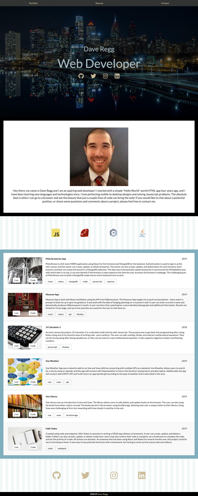

# Dave Regg's Portfolio
> An fullstack MERN application to showcase Dave Regg's portfolio. Users will be able to view projects built by Dave Regg. Users will also be able to navigate to two additional pages - Contact, with contact information for Dave Regg, and Resume, which has Dave Regg's CV.

## Table of contents
* [General info](#general-info)
* [Screenshots](#screenshots)
* [Technologies](#technologies)
* [Setup](#setup)
* [Features](#features)
* [Status](#status)
* [Inspiration](#inspiration)
* [License](#license)
* [Contact](#contact)

## General info
The purpose of this application is to build a fullstack application that gives Dave Regg a place to showcase his portfolio. The application is built on an Express server and contacts a NoSQL Database, MongoDB. The client side is built with React and the state is maintained with Redux. The application utilizes the react-router-dom in order to navigate to two additional pages. The Resume page is a text-only page with Dave Regg's relevant information. The Contact page is built so users may contact Dave Regg. The contact form uses nodemailer on the backend in order to send an email directly to Dave Regg's email address. Users can GET requests, while the admin will UPDATE, CREATE, and DELETE information after signing into the webpage using bcrypt and jsonwebtoken. CREATE and EDIT information are sent to the database using forms, unobtainable through the client side without a login. The application is completely mobile-ready.

## Screenshots


## Technologies
* Node - version 12.3.1
* Bcrypt - version 2.4.1
* Express - version 4.17.1
* Jsonwebtoken - version 8.5.1
* Mongoose - version 5.7.6
* Nodemailer - version 6.3.1
* Moment - version 2.26.0
* React-Moment - version 0.9.7
* Axios - version 0.19.0
* React - version 16.10.2
* React-redux - version 7.1.1
* Redux - version 4.0.4

## Setup
1. Clone the repo
```sh
git clone https://github.com/drregg6/dr-portfolio.git
```
2. Install NPM packages
```sh
npm install
```

## Features
List of features ready and TODOs for future development
* Desktop to Mobile design
* USERS may GET and view information
* ADMIN may POST information to the database by utilizing admin routed forms
* ADMIN may DELETE information after being signed in
* Users can contact admin by using the built-in form

To-do list:
* Update information

## Status
_Completed_ and _Launched_ at [my homepage](http://www.daveregg.com)

## Inspiration
The project is a prompt on [freeCodeCamp](https://www.freecodecamp.org)

## License
This project is licensed under the MIT License - see the [LICENSE.md](LICENSE.md) file for details

## Contact
Dave Regg - [@daveregg](https://www.twitter.com/daveregg) - dave.r.regg@gmail.com

Project Link: [https://github.com/drregg6/dr-portfolio](https://github.com/drregg6/dr-portfolio)

## Acknowledgments
* Traversy Media
* Warm coffee
* Fun